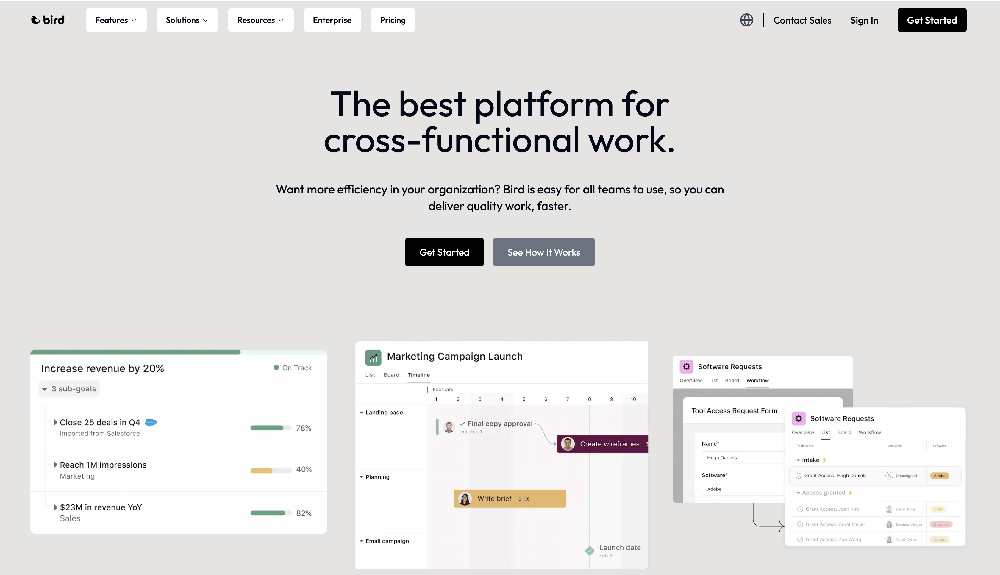

# Asvna

-------------------------------------

## Introduction

This is a clone of the infamous ***Asana***, the project management app that organizes work for teams and individuals. Asvna is a flexible and easy tool for cross-functional work, marketing, IT, and more. Connect your work to goals, automate processes, and integrate with 200+ apps to deliver quality work faster.

#### Technologies

This project makes use of the ground-breaking capabilities of the NextJS 14 App Router. It also allows for quick client-side routing, which makes the user experience more smooth and intuitive.

### Prerequisites

- **Node version 18.x.x**
- **NextJS version 14.x.x**

### Install Packages

Choose the package manager of your choice; `npm i` or `yarn add`
~~~
    @hookform/resolvers
    @radix-ui/react-accordion
    @radix-ui/react-dialog
    @radix-ui/react-navigation-menu
    @radix-ui/react-label
    @radix-ui/react-select
    @radix-ui/react-slot
    @radix-ui/react-switch
    @radix-ui/react-toast
    class-variance-authority
    clsx
    flubber
    framer-motion
    lucide-react
    next
    nodemailer
    nodemailer-smtp-transport
    react
    react-dom
    react-hook-form
    react-infinite-logo-slider
    tailwind-merge
    tailwindcss-animate
    zod
~~~

#### Shadcn UI
For shadcn components, `npx shadcn-ui@latest add [component]` Replace \[component\] with the name of the ui component you wish to install.
Here's some examples used in the project:

| component     | description |
|:--------------|:------------|
|`accordion`    |A vertically stacked set of interactive headings that each reveal a section of content.|
|`button`       |Displays a button or a component that looks like a button.|
|`form`          |Forms are tricky. They are one of the most common things you'll build in a web application, but also one of the most complex. The <Form /> component is a wrapper around the `react-hook-form` library.|
|`input`         |Displays a form input field or a component that looks like an input field.|
|`label`         |Renders an accessible label associated with controls.|
|`navigation-menu`|A collection of links for navigating websites.|
|`select`        |Displays a list of options for the user to pick from—triggered by a button.|
|`separator`     |Visually or semantically separates content.|
|`sheet`         |Extends the Dialog component to display content that complements the main content of the screen.|
|`switch`          |A control that allows the user to toggle between checked and not checked.|
|`text-area`     |Displays a form textarea or a component that looks like a textarea.|
|`toast`         |A succinct message that is displayed temporarily.|

### Credits

All the credit 👏🏾 for this project goes to [Bird Software Inc.](https://www.youtube.com/@BirdSoftwareInc) 🌟. He build the original project on which this was based. 
Watch and follow the step by step tutorial here [Youtube Tutorial](https://youtu.be/1I_mXozC1K4). Don't forget to leave a like and subscribe if you enjoy it. 
You can follow along with the code from the project's [Github Repo](https://github.com/iggy-tech/asana-clone.git) here. Leave a star if you wish.